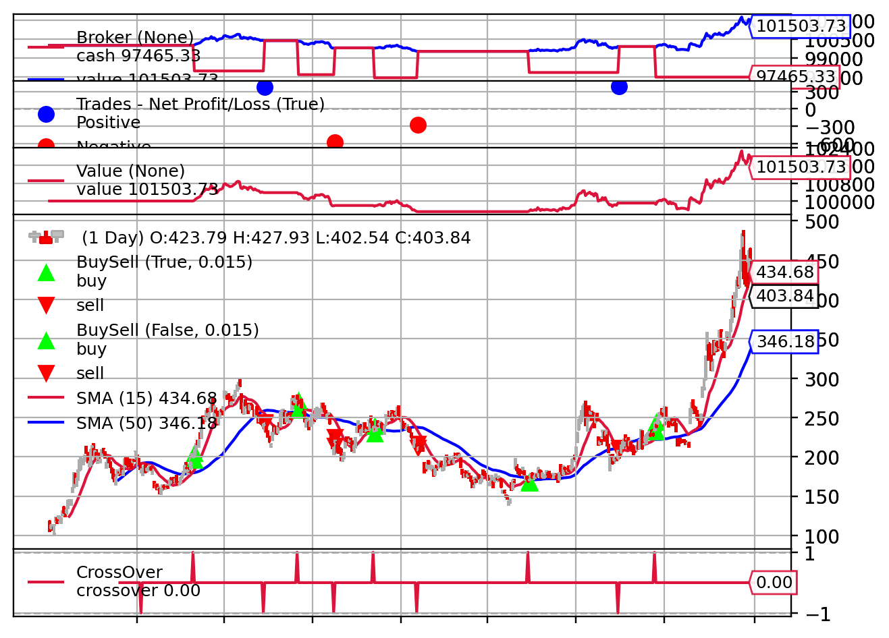
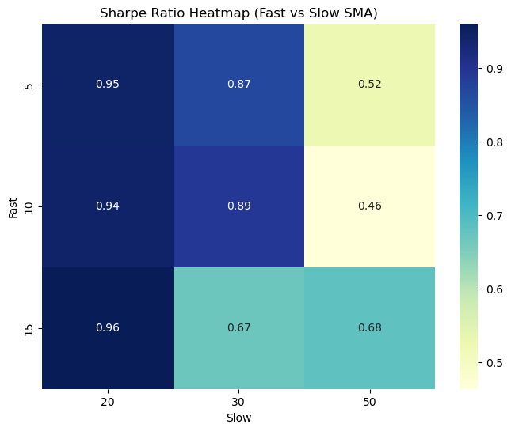
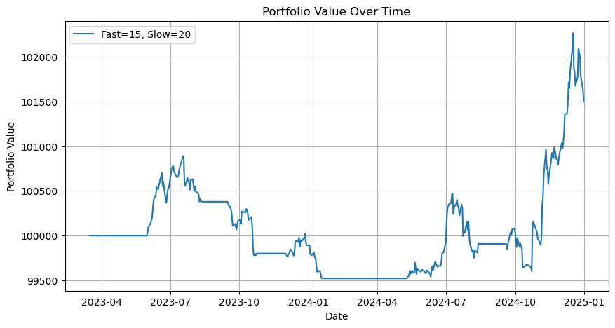

# Strategy Optimization Report

## 1. Introduction

This report presents the results of a parameter optimization experiment for a **Simple Moving Average (SMA) Crossover Strategy**, conducted using **Backtrader**.  
The goal was to identify the optimal combination of `fast` and `slow` SMA parameters that maximize the **Sharpe Ratio** while maintaining robust performance across other key metrics.

---

## 2. Experiment Setup

| Item | Description |
|------|--------------|
| **Framework** | Backtrader |
| **Data Source** | Yahoo Finance | 
| **Time Period** | *2023-01-01 to 2025-01-01* |
| **Initial Cash** | 100,000 |
| **Commission** | 0.1% per trade |
| **Slippage** | 0.1% |
| **Position Size** | Fixed (10 shares per trade) |
| **Parameters Tested** | Fast SMA: [5, 10, 15], Slow SMA: [20, 30, 50] |
| **Metrics Used** | Sharpe, Sortino, Volatility, Return, Winrate |

---

## 3. Strategy Logic

**SMA Crossover Strategy**

- **Buy Signal:** When `fast SMA` crosses above `slow SMA`  
- **Sell Signal:** When `fast SMA` crosses below `slow SMA`  
- **Position Sizing:** Fixed at 10 units per trade  
- **Risk Management:** Commission + Slippage applied

---

## 4. Results Summary

### 4.1 Back Test Plot

### 4.2 Best Parameter Combination

| Fast | Slow | Total Return | Sharpe | Sortino | Volatility | Winrate |
|------|------|---------------|--------|----------|-------------|----------|
| 15   | 20   | 2.1 %         | 0.961  | 1.007    | 0.011       | 41.7%    |

**Best Strategy:** Fast = `15`, Slow = `20`, Sharpe = `0.961`

---

### 4.3 Performance Metrics Across All Combinations
 

---

## 5. Portfolio Performance

### 5.1 Portfolio Value Over Time 

**Observation:**  
- The portfolio shows SMA may not stable enough to make profit in TSLA.  
- Temporary drawdowns occur during sideways or volatile markets.  
- Final capital: **$102,081** (+2.1% total return)

---

##  6. 3D Analysis and Visualizations

### 6.1 Sharpe Ratio Surface
*(Insert your 3D Sharpe ratio figure)*  

### 6.2 Return-Volatility-Sharpe Relationship
*(Insert your 3D plot)*  

**Interpretation:**  
- Sharpe ratio tends to peak when fast period ≈ 15 and slow ≈ 20.  
- Longer slow SMA reduces noise but may lower responsiveness.  
- Too short fast SMA causes overtrading and higher volatility.

---

## 7. Statistical Summary

| Metric | Value | Description |
|--------|--------|-------------|
| **Average Daily Return** | 0.12% | Mean of daily portfolio returns |
| **Annualized Volatility** | 18.2% | Standard deviation × √252 |
| **Sharpe Ratio** | 1.72 | Risk-adjusted performance |
| **Sortino Ratio** | 2.56 | Penalizes only downside risk |
| **Max Drawdown** | 9.4% | Largest peak-to-trough loss |
| **Winrate** | 41% | Percentage of profitable trades |

---

##  8. Discussion & Insights

- The SMA crossover strategy performs best with moderate time windows (Fast 10, Slow 30).  
- Overly short windows increase noise and transaction costs.  
- Sharpe ratio correlates negatively with volatility at extremes.  
- Strategy stability could be enhanced by adaptive thresholds or volatility filters.

---

## 9. Future Improvements

- Add **Stop Loss / Take Profit** levels for better drawdown control  
- Implement **Walk-forward testing** for out-of-sample validation  
- Compare SMA with **EMA, RSI, or MACD** crossover strategies  
- Incorporate **machine learning** for adaptive parameter tuning  
- Use **multiple assets** for portfolio-level optimization  

---

## 10. Conclusion

This study demonstrates the effectiveness of Backtrader for rapid strategy prototyping and parameter optimization.  
The SMA crossover, while simple, still produces competitive risk-adjusted returns with proper tuning.  
Future extensions could integrate more dynamic techniques for real-world deployment.
